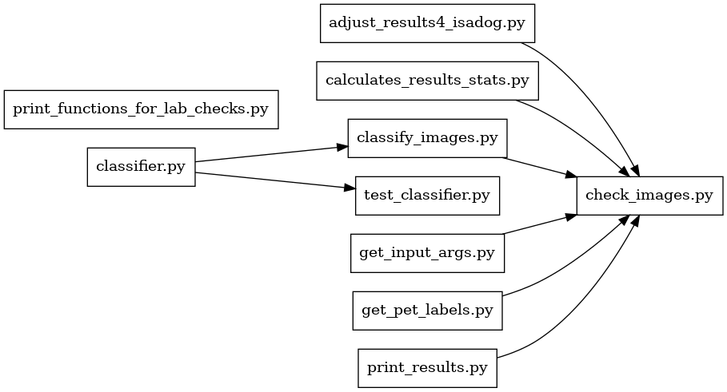
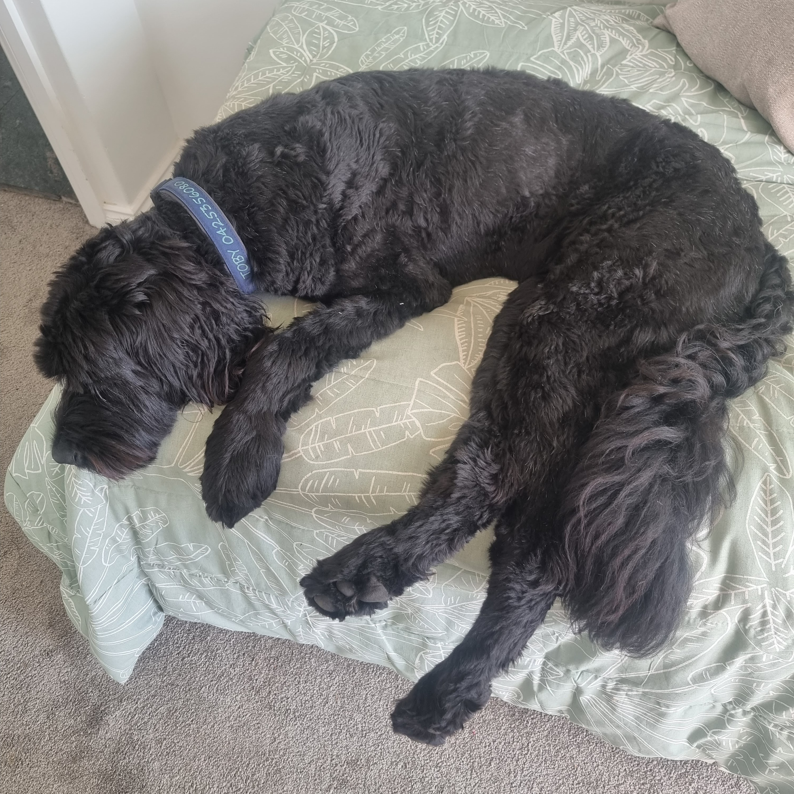
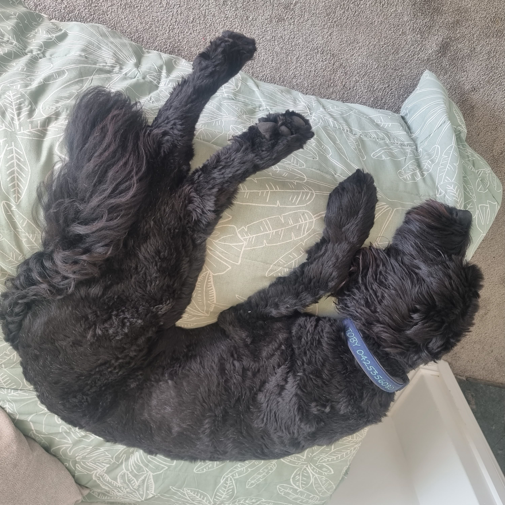
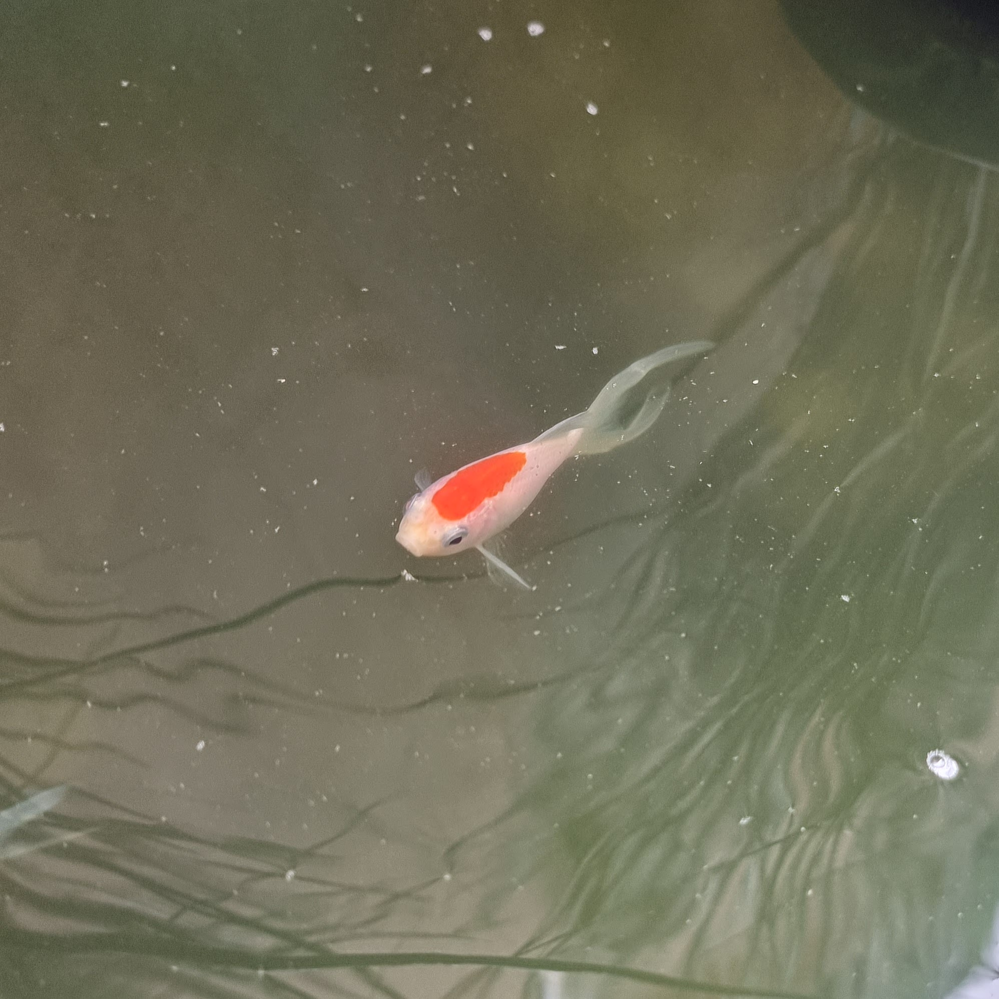

# intro-to-python-for-ai-programmers
## File relationship diagram


## Local setup
### Virtual python environment
```shell
 $ mkdir project_id_dog_breed_python_venv
 $ python3 -m venv project_id_dog_breed_python_venv/
 $ source project_id_dog_breed_python_venv/bin/activate
 # TIP: "(project_id_dog_breed_python_venv) deactivate" when finished using that python environment.
```

### Required python packages to install in project_id_dog_breed_python_venv
```shell
(project_id_dog_breed_python_venv) python -m pip install Pillow
(project_id_dog_breed_python_venv) python -m pip install torchvision
```
## Script running
```shell
# To compare 3 x models against 40 images test set.
(project_id_dog_breed_python_venv) ./run_models_batch.sh
# To compare 3 x models against 4 own images test set.
(project_id_dog_breed_python_venv) ./run_models_batch_uploaded.sh
```

## Questions regarding Uploaded Image Classification:
| Dog_01.jpg | Dog_02.jpg | Fish_01.jpg | Glass_01.jpg |
| :-: | :-: | :-: | :-: |
|||||

1. **_Did the three model architectures classify the breed of dog in Dog_01.jpg to be the same breed? If not, report the differences in the classifications._**
- Answer: Yes, the three model architectures (alexnet, resnet and vgg) correctly classified the breed of dog in Dog_01.jpg as "dog" (aka last list item in "dognames.txt").

2. **_Did each of the three model architectures classify the breed of dog in Dog_01.jpg to be the same breed of dog as that model architecture classified Dog_02.jpg? If not, report the differences in the classifications._**
- Answer: Yes, the three model architectures (alexnet, resnet and vgg) correctly classified the breed of dog in Dog_02.jpg as "dog" (aka last list item in "dognames.txt").

3. **_Did the three model architectures correctly classify Animal_Name_01.jpg and Object_Name_01.jpg to not be dogs? If not, report the misclassifications._**
- Answer: Yes, the three model architectures (alexnet, resnet and vgg) correctly classified Fish_01.jpg as "fish" and Glass_01.jpg as "glass".

4. **_Based upon your answers for questions 1. - 3. above, select the model architecture that you feel did the best at classifying the four uploaded images.
Describe why you selected that model architecture as the best on uploaded image classification._**
- Answer:
  - <ins>Project objective 1:</ins> Correctly identify which pet images are of dogs (even if the breed is misclassified) and which pet images aren't of dogs.
    - Based on the answers in 1. - 3. above the 3 models performed equally well at meeting this project objective.
  - <ins>Project objective 2:</ins> Correctly classify the breed of dog, for the images that are of dogs. 
    - The 3 x models all flagged "INCORRECT Dog Breed Assignment" of "dog", however this is due to my dogs breed ("Bernadoodle") not part of the training set.

## Final Results
- Total Images: 4.
- Dog Images: 2.
- Not-a-dog Images: 2.

| CNN Model Architecture | % Correct Not-a-dog | % Correct Dog | % Correct Breed | % Match Labels |
|:----------------------:|:-------------------:|:-------------:|:---------------:|:--------------:|
|        AlexNet         |         100         |      100      |        0        |       25       |
|         ResNet         |         100         |      100      |        0        |       50       |
|          VGG           |         100         |      100      |        0        |       25       |
